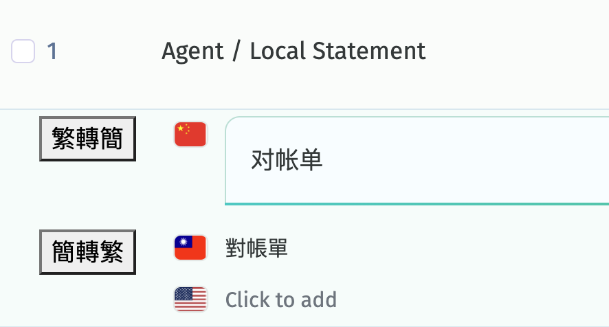

# POEditor Helper

This is a Chrome Extension that let user translate zh_TW between zh_Hans with one click.




## How to develop

Run following commands in project root:

```bash
npm install
npm run watch
```

After finish, go to Chrome extension settings page and click `Load unpacked` in top left corner.
Then in dialog box, select `dist` folder in project root.

## How to compile for production

Run following commands in project root:

```bash
npm run build
```

The compiled artifact for production environment can be found in `dist` folder.
